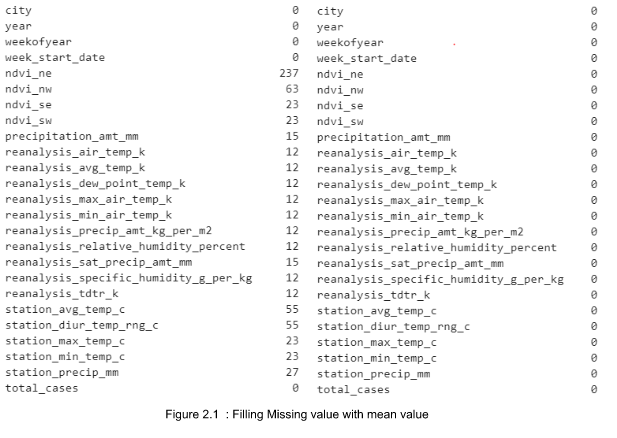
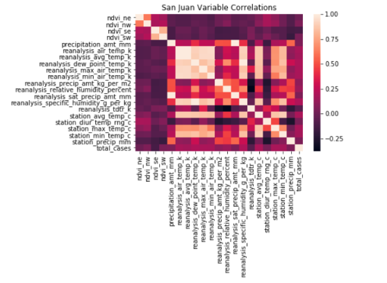
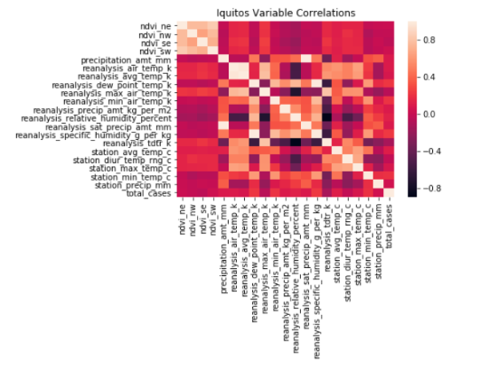
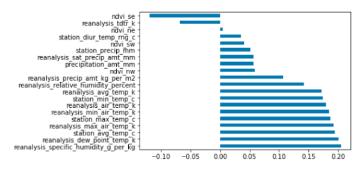
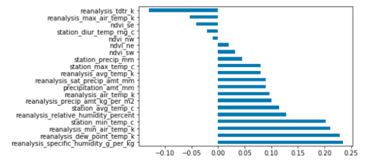
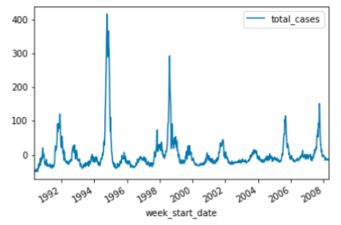
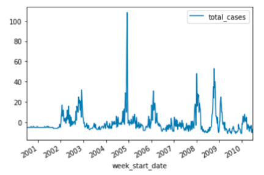
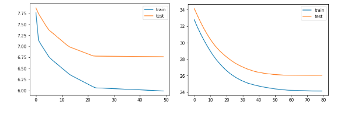
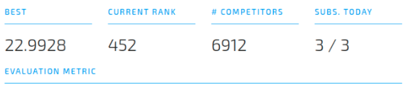

# [DengAI Predicting Disease Spread](https://www.drivendata.org/competitions/44/dengai-predicting-disease-spread/)
## HOSTED BY DRIVENDATA

Dengue virus, one of the most infectious diseases which can result in death for innocent life. Since it is spreading via mosquitos finding a pattern to detect spreading of dengue mosquito will be a chance to rise against it. 
In this project, I purpose a methodology and analysis between existing data mining technique to detect a vital pattern of spreading of dengue virus.

## Procedures

Overall, the proposed methodology provides a framework for using data mining techniques to detect patterns in data related to the spread of dengue virus. By applying these techniques to data on temperature, precipitation, humidity, and vegetation, it may be possible to identify trends and predict the future spread of the virus, which can help to inform public health efforts to combat it.

## Data Preprocessing

### Description of features

In this section, a brief description of the features that are included in the data set will be elaborated. Altogether there are 21 features that can be categorized into 4 main subparts namely temperature, precipitation, humidity and vegetation.

| |Name of Feature|Description|
|:----|:----|:----|
|1|weekofyear|Week number|
|2|ndvi_ne|Normalized difference vegetation index - northeast of city centroid|
|3|ndvi_nw|Normalized difference vegetation index - northwest of city centroid.|
|4|ndvi_se|Normalized difference vegetation index - southeast of city centroid.|
|5|ndvi_sw|Normalized difference vegetation index - southwest of city centroid|
|6|precipitation_amt_mm|Total precipitation (satellite measurements)|
|7|reanalysis_air_temp_k|Mean air temperature (NCEP Climate Forecast System)|
|8|reanalysis_avg_temp_k|Average air temperature (NCEP Climate Forecast System)|
|9|reanalysis_dew_point_temp_k|Mean dew point temperature (NCEP Climate Forecast System)|
|10|reanalysis_max_air_temp_k|Maximum air temperature (NCEP Climate Forecast System)|
|11|reanalysis_min_air_temp_k|Minimum air temperature (NCEP Climate Forecast System)|
|12|reanalysis_precip_amt_kg_per_m2|Total precipitation (NCEP Climate Forecast System)|
|13|reanalysis_relative_humidity_percent|Mean relative humidity (NCEP Climate Forecast System)|
|14|reanalysis_sat_precip_amt_mm|Total precipitation (NCEP Climate Forecast System)|
|15|reanalysis_specific_humidity_g_per_kg|Mean specific humidity (NCEP Climate Forecast System)|
|16|reanalysis_tdtr_k|Diurnal temperature range (NCEP Climate Forecast System)|
|17|station_avg_temp_c|Average temperature (weather station measurements)|
|18|station_diur_temp_rng_c|Diurnal temperature range (weather station measurements)|
|19|station_max_temp_c|Maximum temperature (weather station measurements)|
|20|station_min_temp_c|Minimum temperature (weather station measurements)|
|21|station_precip_mm|Total precipitation (weather station measurements)|

### Feature Engineering 
At the first step of feature engineering, It is clear that the data set can be separated into two main sub-categories by cities where the data were collected(936 out of 1456 is SJ an reset is IQ). Therefore data analytics will be carried on to each category separately.

#### Dealing with missing values 
Before further analysis, it is essential to deal with missing values that will affect the model drastically. Thus, missing values are detected and filled with the mean on itself.

#### Feature correlation 

Since the data set contains two cities, data correlation metrics were taken according to each corresponding city to avoid unnecessary relations. After finding a better correlation between features, it can be used to avoid the curse of dimensionality and the curse of cardinality. This process will improve the accuracy of the entire model by avoiding unnecessary feature addition.

There are no considerable relationship among features because all most all the regions are dark in colour complexion which tells us the negative correlation among the features.

The correlation between the target and the feature is not tightly coupled for specific levels. It is possible to reduce some of the less contributive features for the targeted output. It is clear that some of the features negatively correlated with the target which can be omitted in the creation of the model.
`reanalysis_specific_humidity_g_per_kg` and `reanalysis_dew_point_temp_k` are the most strongly correlated with the target class. 
The rising temperature impacts the total cases, and precipitation does not significantly correlate with the target. This vital information can be used in the feature selection process.

#### Output in a time series 

Targeted output has a seasonal factor as well as a random factor. This will more emphasize by sudden peaks in the diagram. Thus, the model should also be capable of considering those factors.

As per the feature correlation analysis, some features were correlated by more than 95%. 

**Iquitos data**
* Features “precipitation_amount_mm” and “reanalysis_sat_precip_amt_mm” were found to be 100% correlated.
* Features “reanalysis_dew_point_temp_k” and “reanalysis_specific_humidity_g_per_kg” were found to be 99.77% correlated.
* Features “reanalysis_avg_temp_k” and “reanalysis_air_temp_k” were found to be 97.33% correlated.

**San Juan data**
* Features “precipitation_amount_mm” and “reanalysis_sat_precip_amt_mm” were found to be 100% correlated.
* Features “reanalysis_dew_point_temp_k” and “reanalysis_specific_humidity_g_per_kg” were found to be 99.85% correlated.
* Features “reanalysis_avg_temp_k” and “reanalysis_air_temp_k” were found to be 99.75% correlated.
* Features “reanalysis_max_air_temp_k” and “reanalysis_avg_temp_k” were found to be 93.89% correlated.
* Features “reanalysis_min_air_temp_k” and “reanalysis_avg_temp_k” were found to be 93.91% correlated.
* Features "reanalysis_dew_point_temp_k" and “reanalysis_air_temp_k” were found to be 90.33% correlated.
Based on the value reanalysis, we have decided feature deletion

#### Feature Selection

Since mosquitoes have a life cycle, they can correlate to the output target. This can be achieved by shifting three weeks for each city.
According to the above observations in each section, the below features are selected for creating a model for the prediction.

* station_min_temp_c
* reanalysis_min_air_temp_c
* reanalysis_dew_point_temp_k
* reanalysis_specific_humidity_g_per_kg

### Discussion 

* Dengue disease is kind of spreading disease. If patients are founded on any geological region there is a probability that there will be other patients from the same geological area. Thus, it is import to train a model according to the geological area.
* Dengue disease will always spread across within a period. At the beginning, individual's are not concerned about the disease and more likely to spread increasingly. Soon after the identification of the disease, individuals are taking prevention steps so the disease can be controlled. This cycle will be continued if there is no proper prevention mechanism being taken by the respective authorities. Thus the model should be adjusted according to the period pattern when it is started and ended.
* As per time series plots, it is clear that the target output has a pattern for each city and the occurrences of sudden random increases.
* Sudden occurrences of the output indicate that proper prevention mechanisms are not being taken and they also have a pattern in a long term perspective.  
* Several features are positively correlated to the output feature where others are negatively or not correlated at all.   positively correlated features are used to train and test the model.
* Since the dataset contains 21 features, the model should be capable of handling more dimension of features or select more relevant features to build the model.
* Target predicting model should be able to preserve the above mentioned the properties to get a precise and accurate design.

## Modelling  

Throughout our research process, we used different techniques such as 
* preprocessing
* selecting a good model
* feature engineering

We preprocessed the dataset as mentioned in the previous section. Later we researched on various models such as 
* linear regression
* NegativeBinomial 
* Poisson model
* XGBoost model
* LSTM & GRU model
The results from the prediction are given below.

### Linear regression
As per the target variable distribution and the correlation of features with the target variable, the Linear regression is not a recommended method. But still, to understand the simplest method's result, we have tried this as our first approach. 

|Model|city data|MAE|
|:----|:----|:----|
|​Linear Regression|San Juan|27.09|
|Linear Regression|Iquitos|9.11|
|Linear Regression WITH FFS|San Juan|25.78|
|Linear Regression WITH FFS|Iquitos|5.59 - Good Result|
|Lasso L1 Regularisation|San Juan|22.82 Good Result|
|Lasso L1 Regularisation|Iquitos|8.02|

### NegativeBinomial
Negative binomial regression is a type of generalized linear model in which the dependent variable is a count of the number of times an event occurs. In this case, the target variable is a count of dengue cases reported each week. And the data has high variance compared to mean, and dispersed data, so we thought that the regression model is matching for our data set.

|Model|city data|MAE|
|:----|:----|:----|
|Negative Binomial Train|San Juan|24.98|
|Negative Binomial Train|Iquitos|5.34|
|Negative Binomial Test|San Juan|19.27|
|Negative Binomial Test|Iquitos|7.97|

### Poisson Regression
If the data is dispersed, this model is not good for prediction. Still, the data is a count type of distribution, so we have tried the poisson model too.

|Model|city data|MAE|
|:----|:----|:----|
|Poisson Model Train|San Juan|26.28|
|Poisson Model Train|Iquitos|5.35|
|Poisson Model Test|San Juan|19.51|
|Poisson Model Test|Iquitos|7.98|

### XGBoost Model

Even the more advanced ensemble models like XGBoost did not significantly improve the performance.

|Model|city data|MAE|
|:----|:----|:----|
|XGBoost Model Train|San Juan|7.5|
|XGBoost Model Train|Iquitos|17.03703704|
|XGBoost Model Test|San Juan|11.84615385|
|XGBoost Model Test|Iquitos|7.243243243|

### LSTM model

LSTM did not perform well in any of the many architectures (number of nodes and layers) we tried. Our best recurrent model implementation was with Gated Recurrent Unit (GRU) networks. But typically learning plateaued rather quickly for both Iquitos and San Juan data even for GRU, as seen in the plots below

In the final part we have followed kind of ensembling approach we have replaced the negative values with the common values given by the models we tried earlier.   
In our last part of the project, we continually ran our best neural network model (GRU) against a variety of dataset configurations with time windows ranging from 1 to 16  weeks, and we experimented with different autocorrelation configurations. We analysed our best models against versions of the dataset containing weather-related data only, total cases only, and a mix of both. Results were not sensitive to these changes. Additionally, we have tested our best models on a large number of epochs, up to 5000. 

## Conclusion

In the process of building the model that will predict the number of dengue patients in a particular area, Several methods of data preprocessing were taken place. The dataset contained a notable missing value, thus a mean value filling mechanism was used to fill the missing value as a replacement. To avoid the curse of dimensionality, 4 main features were selected by using correlation matrices.    
* station_min_temp_c
* reanalysis_min_air_temp_c
* reanalysis_dew_point_temp_k
* reanalysis_specific_humidity_g_per_kg

Targeted output was plotted and visualized to understand the distribution of the output with time and locality. Graph of the output with time showed a clear pattern in the output with time and locality which was used to train and test the model separately according to the geological area.
Linear regression, Negative binomial, Poisson model, XGBoost model and LSTM model is used to train and test the DengAI dataset. Among these machine learning algorithm, LSTM model was able to produce 22.9958 in MAE and got a rank of 452 as at 2019.06.28. 

